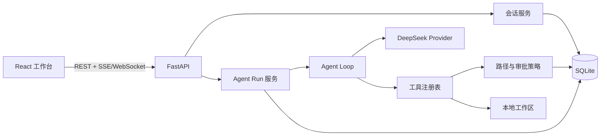

# DSH Lite

DSH Lite 是一个面向 DeepSeek 的轻量级 Agent Harness 仿写项目。后端采用 **FastAPI + LangChain + LangGraph**，前端采用 **Vite 8 + React 19 + TypeScript**，目标是在尽量少的依赖和代码复杂度下，实现一个可运行、可扩展、可观察的本地 AI Agent 工作台。

> 当前状态：项目初始化阶段。仓库已规划 `server/` 与 `website/` 两个工作区，具体功能仍在实现中。

## 项目目标

DSH Lite 关注 Agent Harness 的核心链路，而不是复刻完整的商业产品：

- 接收用户任务，并维护多轮会话上下文
- 调用 DeepSeek 的 OpenAI 兼容 API 进行推理
- 通过工具调用读写文件、搜索代码、执行命令
- 将模型输出、工具调用和执行结果实时推送到前端
- 在本地保存会话、消息、运行记录和工具审批状态
- 对高风险工具调用提供审批与工作区边界控制
- 保持模块清晰，便于替换模型、存储和工具实现

## 核心能力

### Agent 运行循环

后端维护一次 Agent Run 的状态机：

```text
用户输入
  -> 构造上下文
  -> 调用模型
  -> 解析文本或工具调用
  -> 执行工具
  -> 将工具结果回填上下文
  -> 继续推理
  -> 返回最终结果
```

运行循环需要支持流式输出、取消、错误重试、最大步数限制和 token 使用统计。

### 工具系统

工具采用统一注册与调用协议，计划内置：

| 工具 | 作用 | 默认风险级别 |
| --- | --- | --- |
| `read_file` | 读取工作区文件 | 低 |
| `write_file` | 创建或覆盖文件 | 中 |
| `edit_file` | 对文件进行精确替换 | 中 |
| `list_files` | 浏览目录结构 | 低 |
| `search_files` | 按文件名或内容搜索 | 低 |
| `run_command` | 在受控目录中执行命令 | 高 |
| `todo_write` | 维护当前任务计划 | 低 |

工具执行应遵循以下约束：

- 所有路径必须解析到授权工作区内
- 命令使用参数数组执行，避免直接拼接 shell 字符串
- 高风险操作必须经过用户审批
- 记录工具参数、结果、耗时和错误信息
- 支持超时、取消和输出长度截断

### 会话与持久化

计划使用 SQLite 作为默认存储，核心数据包括：

- `sessions`：会话元数据和当前工作区
- `messages`：用户、助手、系统与工具消息
- `runs`：一次 Agent 任务的运行状态
- `tool_calls`：工具调用及审批记录
- `usage`：模型 token 消耗统计

数据层通过 Repository 接口隔离，后续可以替换为 PostgreSQL 或其他存储。

### 前端工作台

React 前端计划提供：

- 会话列表与新建会话
- 流式消息展示
- 工具调用卡片与执行状态
- 命令输出和文件变更预览
- 工具审批弹窗
- 运行取消与重新执行
- 工作区选择与基础设置

## 技术栈

### 后端

- Python 3.12+
- FastAPI + Uvicorn
- Pydantic v2 + pydantic-settings
- LangChain + LangGraph
- `langchain-openai`，通过 OpenAI 兼容协议接入 DeepSeek
- `langgraph-checkpoint-sqlite` 持久化 Graph 状态
- SQLAlchemy 2 + aiosqlite + Alembic
- SSE 流式传输
- pytest + HTTPX + respx
- uv + Ruff + mypy

### 前端

- Vite 8
- React 19 + TypeScript
- React Router
- TanStack Query + Zustand
- React Hook Form + Zod
- Tailwind CSS + Radix UI
- `react-markdown` + `remark-gfm` + `remark-math`
- `rehype-sanitize` + `rehype-katex`
- Shiki + Mermaid
- TanStack Virtual
- Vitest + Testing Library + MSW + Playwright
- pnpm + ESLint + Prettier

具体依赖版本以初始化后的 `server/pyproject.toml` 和 `website/package.json` 为准。

## 目标目录结构

```text
dsh-lite/
├── server/                     # Python 后端
│   ├── app/
│   │   ├── api/                # HTTP / SSE / WebSocket 接口
│   │   ├── agent/              # Agent 循环、上下文与提示词
│   │   ├── models/             # 领域模型与数据库模型
│   │   ├── providers/          # DeepSeek 等模型提供方
│   │   ├── tools/              # 工具注册表与内置工具
│   │   ├── services/           # 会话、审批和运行服务
│   │   ├── config.py
│   │   └── main.py
│   ├── tests/
│   └── pyproject.toml
├── website/                    # React 前端
│   ├── src/
│   │   ├── api/
│   │   ├── components/
│   │   ├── features/
│   │   ├── pages/
│   │   ├── stores/
│   │   └── main.tsx
│   ├── public/
│   └── package.json
├── .env.example
└── README.md
```

## 架构概览



前后端通过稳定的运行事件协议通信，例如：

```json
{
  "type": "tool_call",
  "run_id": "run_xxx",
  "call_id": "call_xxx",
  "name": "read_file",
  "arguments": {
    "path": "server/app/main.py"
  }
}
```

常见事件类型包括 `run_started`、`text_delta`、`tool_call`、`tool_result`、`approval_required`、`usage`、`run_completed` 和 `run_failed`。

## 开发计划

### Phase 1：最小可用链路

- [ ] 初始化 FastAPI 服务与健康检查接口
- [ ] 初始化 Vite 8 + React 19 + TypeScript 前端
- [ ] 接入 DeepSeek OpenAI 兼容 API
- [ ] 使用 LangGraph 实现单会话 Agent Loop
- [ ] 实现 `read_file`、`list_files` 和 `search_files`
- [ ] 通过 SSE 流式展示模型文本

### Phase 2：工具与安全边界

- [ ] 实现 `write_file`、`edit_file` 和 `run_command`
- [ ] 增加工作区路径校验
- [ ] 增加工具审批机制
- [ ] 支持取消、超时和最大执行步数
- [ ] 持久化会话、消息与工具调用

### Phase 3：工作台体验

- [ ] 会话列表和历史恢复
- [ ] 工具调用可视化
- [ ] 文件差异与命令输出展示
- [ ] token 用量与运行耗时统计
- [ ] 错误重试与断线恢复

### Phase 4：可扩展性

- [ ] 模型 Provider 接口与多模型切换
- [ ] MCP 或外部工具扩展
- [ ] 测试、评测与回放机制
- [ ] Docker 开发环境与一键启动
- [ ] 可选的 PostgreSQL 存储适配

## 开发端口约定

本地开发统一使用以下端口：

| 服务 | 端口 | 地址 |
| --- | ---: | --- |
| React / Vite 前端 | `3090` | `http://127.0.0.1:3090` |
| FastAPI 后端 | `3099` | `http://127.0.0.1:3099` |

前端通过 Vite Proxy 将 `/api/v1` 转发到 `http://127.0.0.1:3099`。完整约定、环境变量和联调命令见 [开发环境与端口约定](./docs/DEVELOPMENT.md)。

## 配置约定

后续实现将使用环境变量管理敏感配置，预计包括：

```dotenv
DEEPSEEK_API_KEY=your_api_key
DEEPSEEK_BASE_URL=https://api.deepseek.com
DEEPSEEK_MODEL=deepseek-chat
DSH_HOST=127.0.0.1
DSH_PORT=3099
DSH_CORS_ORIGINS=http://127.0.0.1:3090
DSH_WORKSPACE=/absolute/path/to/workspace
DSH_DATABASE_URL=sqlite:///./dsh-lite.db
DSH_MAX_AGENT_STEPS=30
```

`.env` 不应提交到版本库。API Key 仅由后端读取，禁止通过接口或日志返回给前端。

## 设计原则

1. **简单优先**：先用清晰的单进程架构完成闭环，再按需要拆分服务。
2. **边界明确**：模型负责决策，工具负责执行，策略层负责授权和约束。
3. **可观察**：每次模型调用、工具调用和审批都应留下结构化记录。
4. **可替换**：模型、存储、流式协议和工具实现均通过接口隔离。
5. **默认安全**：高风险操作显式审批，文件访问限制在工作区内。

## 非目标

当前版本暂不追求：

- 多租户和团队权限系统
- 云端托管与横向扩容
- 完整 IDE 或代码编辑器能力
- 对所有模型厂商的原生适配
- 与某个商业 Harness 的 API 或 UI 完全兼容

## 参与开发

在项目初始化完成后，本文档将补充经过验证的环境要求、启动命令、测试命令和贡献规范。提交代码前建议遵循以下约定：

- Python 代码使用 Ruff 和 pytest
- TypeScript 代码通过 ESLint、类型检查和 Vitest
- 提交信息描述用户可见变化或核心行为
- 安全相关变更必须附带测试或明确的验证步骤

## 相关文档

- [开发环境与端口约定](./docs/DEVELOPMENT.md)
- [后端说明](./server/README.md)
- [后端 TODO](./server/TODO.md)
- [前端说明](./website/README.md)
- [前端 TODO](./website/TODO.md)

## 说明

DSH Lite 是独立的学习与工程实践项目，与 DeepSeek 官方无隶属或背书关系。DeepSeek 及相关名称归其各自权利人所有。
