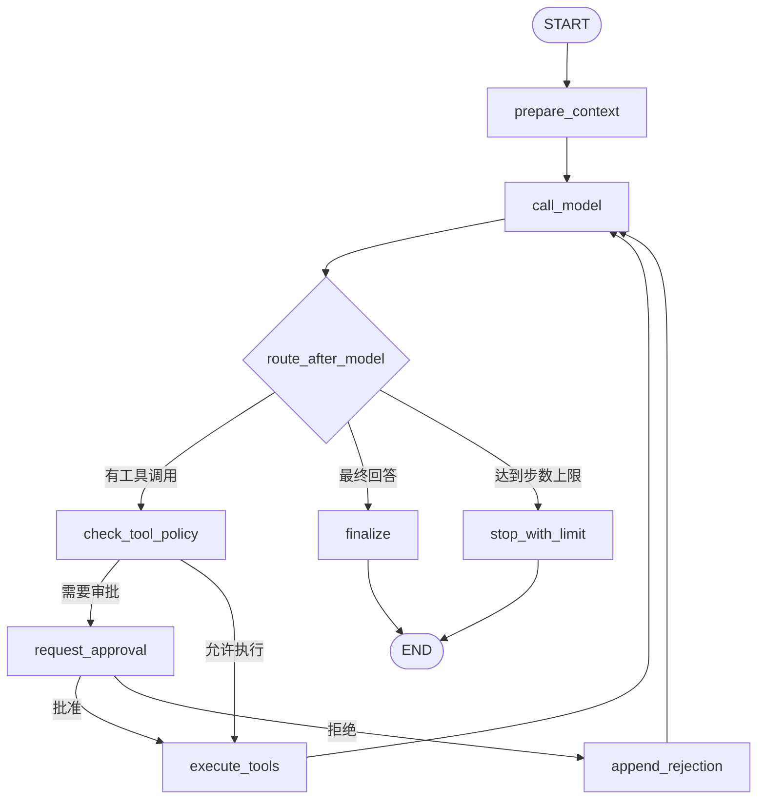

# DSH Lite Server

DSH Lite 的 Python 后端，基于 FastAPI 提供会话、Agent 运行、工具执行、审批和流式事件接口，使用 LangChain 与 LangGraph 构建可持久化、可中断、可恢复的 Agent 工作流。

> 当前状态：目录已创建，后端尚未初始化。本文档描述目标架构和约定，依赖版本与命令将在工程初始化后校准。

## 技术栈

| 领域 | 选型 | 用途 |
| --- | --- | --- |
| 运行时 | Python 3.12+ | 后端运行环境 |
| Web 框架 | FastAPI | REST、依赖注入、OpenAPI 和 SSE |
| ASGI Server | Uvicorn | 本地开发与生产运行 |
| 数据校验 | Pydantic v2 + pydantic-settings | Schema、配置和环境变量 |
| Agent 框架 | LangChain | 消息、模型、Tool 抽象和运行能力 |
| 工作流编排 | LangGraph | 有状态图、条件边、循环和 Human-in-the-loop |
| 模型接入 | `langchain-openai` | 通过 OpenAI 兼容协议连接 DeepSeek |
| Checkpoint | `langgraph-checkpoint-sqlite` | 保存 Graph 状态并支持恢复 |
| 持久化 | SQLAlchemy 2 + aiosqlite | 会话、消息、运行和审批记录 |
| 数据迁移 | Alembic | 数据库 Schema 版本管理 |
| 流式输出 | SSE + sse-starlette | 向前端推送文本和工具事件 |
| HTTP 客户端 | HTTPX | 外部服务调用与测试 |
| 重试 | Tenacity | 可配置的模型和网络重试 |
| 日志 | structlog | 结构化日志和请求上下文 |
| 测试 | pytest + pytest-asyncio + HTTPX + respx | 单元、接口和外部调用测试 |
| 质量 | Ruff + mypy | 格式化、Lint 和静态类型检查 |
| 包管理 | uv | 虚拟环境、锁文件和依赖管理 |

依赖以 `pyproject.toml` 和 `uv.lock` 为单一来源。除确有需要，不引入 `langchain-community` 等宽依赖包。

## 核心职责

- 管理会话、消息、运行和审批记录
- 使用 LangGraph 执行有状态 Agent Loop
- 通过 LangChain Tool Calling 调用本地工具
- 在工具执行前实施路径、命令和风险策略
- 通过 `interrupt()` 暂停高风险操作并等待用户审批
- 使用 Checkpointer 恢复中断或失败的运行
- 通过 SSE 推送模型增量、工具事件和最终状态
- 统计 token、耗时、步数和错误信息

## 目标目录结构

```text
server/
├── app/
│   ├── api/
│   │   ├── deps.py
│   │   ├── router.py
│   │   └── v1/
│   │       ├── sessions.py
│   │       ├── runs.py
│   │       └── settings.py
│   ├── agent/
│   │   ├── graph.py              # LangGraph 定义与编译
│   │   ├── state.py              # AgentState 与 Reducer
│   │   ├── nodes.py              # 模型、工具、审批、收尾节点
│   │   ├── prompts.py
│   │   └── runtime.py            # 单次 Run 的运行时上下文
│   ├── core/
│   │   ├── config.py
│   │   ├── logging.py
│   │   ├── exceptions.py
│   │   └── security.py
│   ├── db/
│   │   ├── base.py
│   │   ├── session.py
│   │   ├── models/
│   │   └── repositories/
│   ├── schemas/
│   │   ├── events.py
│   │   ├── runs.py
│   │   └── sessions.py
│   ├── services/
│   │   ├── agent_service.py
│   │   ├── approval_service.py
│   │   ├── run_service.py
│   │   └── session_service.py
│   ├── tools/
│   │   ├── registry.py
│   │   ├── policy.py
│   │   ├── filesystem.py
│   │   ├── search.py
│   │   ├── shell.py
│   │   └── todo.py
│   ├── main.py
│   └── __init__.py
├── migrations/
├── tests/
│   ├── unit/
│   ├── integration/
│   └── fixtures/
├── .env.example
├── alembic.ini
├── pyproject.toml
└── uv.lock
```

## LangGraph 工作流



图设计原则：

- `call_model` 只负责模型调用与消息合并。
- `check_tool_policy` 负责风险判断，不直接执行工具。
- `request_approval` 使用 LangGraph `interrupt()` 暂停 Graph。
- `execute_tools` 使用 `ToolNode` 或受控并行执行器。
- 每次循环都递增 `step_count`，达到上限必须终止。
- 所有节点只返回状态增量，避免原地修改共享状态。

目标 `AgentState` 至少包含：

```python
class AgentState(TypedDict):
    messages: Annotated[list[AnyMessage], add_messages]
    session_id: str
    run_id: str
    workspace: str
    step_count: int
    pending_approvals: list[ApprovalRequest]
    tool_results: list[ToolResult]
    usage: UsageStats
    error: AgentError | None
```

## 模型接入

DeepSeek 通过 OpenAI 兼容接口接入 `langchain-openai`：

```python
from langchain_openai import ChatOpenAI

model = ChatOpenAI(
    model=settings.deepseek_model,
    api_key=settings.deepseek_api_key,
    base_url=settings.deepseek_base_url,
    streaming=True,
    temperature=settings.model_temperature,
)
```

要求：

- API Key 使用 `SecretStr`，不得写入日志、响应或异常详情。
- `base_url`、模型名、超时和重试次数全部由配置提供。
- 模型调用需要捕获限流、超时、上下文超限和协议错误。
- 通过 callback 或流式事件收集文本增量、tool call 和 usage。
- 提供测试用 Fake Model，避免单元测试依赖真实网络。

## 工具系统

工具使用 LangChain `@tool` 或结构化 `BaseTool` 注册，参数使用 Pydantic Schema。

| 工具 | 风险 | 默认策略 |
| --- | --- | --- |
| `list_files` | 低 | 自动允许，限制工作区 |
| `read_file` | 低 | 自动允许，限制大小与路径 |
| `search_files` | 低 | 自动允许，限制结果数和忽略目录 |
| `write_file` | 中 | 默认审批，禁止工作区外路径 |
| `edit_file` | 中 | 默认审批，要求精确匹配 |
| `run_command` | 高 | 强制审批，参数数组执行，限制超时 |
| `todo_write` | 低 | 自动允许，仅更新运行计划 |

安全边界：

- 使用 `Path.resolve()` 和 `is_relative_to()` 校验路径。
- 拒绝符号链接逃逸、设备文件和敏感系统路径。
- 命令使用 `asyncio.create_subprocess_exec`，不通过 `shell=True` 执行。
- 设置输出上限、执行超时、并发上限和环境变量白名单。
- 每次工具调用都生成稳定的 `call_id` 并记录审计事件。
- 审批超时、连接断开和取消都必须让运行进入确定终态。

## 持久化设计

核心表：

| 表 | 关键字段 |
| --- | --- |
| `sessions` | `id`, `title`, `workspace`, `created_at`, `updated_at` |
| `messages` | `id`, `session_id`, `role`, `content`, `tool_calls`, `created_at` |
| `runs` | `id`, `session_id`, `status`, `step_count`, `usage`, `error` |
| `tool_calls` | `id`, `run_id`, `name`, `arguments`, `result`, `status`, `duration_ms` |
| `approvals` | `id`, `run_id`, `tool_call_id`, `decision`, `decided_at` |

LangGraph Checkpointer 与业务表使用同一个 SQLite 文件，但使用独立表空间。Checkpoint 保存可恢复的 Graph 状态；业务表用于查询、展示和审计，二者职责不混用。

## API 规划

```text
GET    /healthz
GET    /api/v1/sessions
POST   /api/v1/sessions
GET    /api/v1/sessions/{session_id}
DELETE /api/v1/sessions/{session_id}
GET    /api/v1/sessions/{session_id}/messages
POST   /api/v1/sessions/{session_id}/runs
GET    /api/v1/runs/{run_id}
GET    /api/v1/runs/{run_id}/events
POST   /api/v1/runs/{run_id}/cancel
POST   /api/v1/runs/{run_id}/approvals
GET    /api/v1/settings
PATCH  /api/v1/settings
```

SSE 事件类型：

```text
run_started
text_delta
tool_call
tool_result
approval_required
usage
run_completed
run_failed
```

事件必须包含 `event_id`、`run_id`、时间戳和可判别 `type`。服务端持久化关键事件，使前端断线后可以通过 `Last-Event-ID` 或运行详情恢复状态。

## 配置约定

```dotenv
DEEPSEEK_API_KEY=your_api_key
DEEPSEEK_BASE_URL=https://api.deepseek.com
DEEPSEEK_MODEL=deepseek-chat
DSH_HOST=127.0.0.1
DSH_PORT=3099
DSH_CORS_ORIGINS=http://127.0.0.1:3090
DSH_WORKSPACE=/absolute/path/to/workspace
DSH_DATABASE_URL=sqlite+aiosqlite:///./dsh-lite.db
DSH_MAX_AGENT_STEPS=30
DSH_TOOL_TIMEOUT_SECONDS=120
DSH_LOG_LEVEL=INFO
```

配置使用 `pydantic-settings` 加载并校验。`.env` 不提交，生产环境优先使用系统环境变量或 Secret Manager。

## 开发命令

初始化完成后使用以下命令：

```bash
uv sync --all-groups
uv run uvicorn app.main:app --reload --host 127.0.0.1 --port 3099
uv run pytest
uv run ruff check .
uv run ruff format --check .
uv run mypy app
uv run alembic upgrade head
```

OpenAPI 文档默认位于 `http://127.0.0.1:3099/docs`，健康检查位于 `http://127.0.0.1:3099/healthz`。

## 设计原则

1. **Graph 负责编排**：业务流程放在 LangGraph 节点和边中，不在 API 层堆叠控制逻辑。
2. **工具受策略控制**：模型只能提出调用，执行必须经过注册表和策略层。
3. **状态可恢复**：关键节点使用 Checkpointer，进程重启后可以判断并恢复运行。
4. **事件可回放**：关键状态变化持久化，SSE 不是唯一事实来源。
5. **默认安全**：工作区边界、命令审批、超时和输出限制默认开启。
6. **测试不触网**：单元测试使用 Fake Model 和 Mock Tool，集成测试显式启用真实外部调用。

## 相关文档

- [开发环境与端口约定](../docs/DEVELOPMENT.md)
- [后端 TODO](./TODO.md)
- [前端说明](../website/README.md)
- [项目说明](../README.md)
